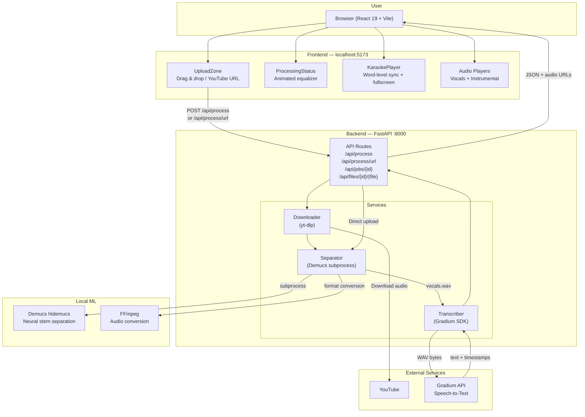
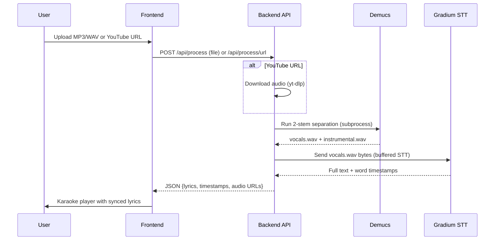

# KaraAI — AI-Powered Karaoke in Seconds

**Tech Europe Paris AI Hackathon** | February 7-8, 2026 | Solo Developer

> Drop a song. Get karaoke. .

KaraAI takes any song — uploaded as a file or pasted as a YouTube link — and transforms it into a fully interactive karaoke experience. The app separates vocals from instrumentals, transcribes the lyrics with word-level timestamps, and delivers a real-time karaoke player with synchronized highlighting, all in under three minutes.

---

## Product Value

**The problem:** Creating karaoke tracks today is a manual, tedious process — someone has to isolate the instrumental, transcribe lyrics, and synchronize every word by hand. Professional karaoke production costs hundreds of dollars per track.

**Our solution:** KaraAI automates the entire pipeline with AI. One upload, one click, and you get:

- **Separated audio stems** — clean vocals and instrumentals powered by Meta's Demucs neural network
- **Word-level synchronized lyrics** — automatic transcription with precise timestamps via Gradium STT
- **Interactive karaoke player** — real-time word highlighting, auto-scroll, and fullscreen mode

**Beyond karaoke**, KaraAI exposes a reusable audio-text pipeline: stem separation, word-level transcription, and synchronized playback.

Those same building blocks enable use cases like replacing song vocals with branded voiceovers for marketing, generating custom jingles with preserved timing, providing fully synchronized lyrics for accessibility, or building language-learning tools where users can replay and inspect individual words.

Once audio can be split, timed, and rendered automatically, karaoke is just one application.

---

## How to Test the App

### Prerequisites

| Dependency | Version | Purpose |
|---|---|---|
| **Python** | 3.13+ | Backend runtime |
| **Node.js** | 20+ | Frontend build tooling |
| **uv** | latest | Python package manager |
| **FFmpeg** | any recent | Audio format conversion (must be on `PATH`) - On MAC, run `brew install ffmpeg` if you don't have it | 
| **Gradium API key** | — | Speech-to-text transcription |

### 1. Clone and configure

```bash
git clone <repo-url>
cd tech_europe_paris_ai_hackathon
```

Create the backend environment file:

```bash
cp sounds_good_enough/backend/.env.example sounds_good_enough/backend/.env
```

Edit `sounds_good_enough/backend/.env` and set your Gradium API key:

```
GRADIUM_API_KEY=gsk_your_key_here
```

### 2. Start the backend

```bash
cd sounds_good_enough/backend
uv sync
uv run uvicorn app.main:app --reload --host 0.0.0.0 --port 8000
```

> **Note:** The first run downloads the Demucs model weights (~300 MB). Subsequent runs are instant.

### 3. Start the frontend

In a separate terminal:

```bash
cd sounds_good_enough/frontend
npm install
npm run dev
```

The app opens at **http://localhost:5173**.

### 4. Try it out

You have three ways to use the app:

| Method | How |
|---|---|
| **Demo song** | Click "Try with a demo song" (if demo data is seeded in `backend/demo_data/`) |
| **Upload a file** | Drag-and-drop or select an MP3/WAV file (max 50 MB) |
| **YouTube URL** | Paste a YouTube link and click "Start Karaoke!" |

Once processing completes (~1–2 min), you get:

- A **karaoke player** with word-by-word highlighting synchronized to the instrumental track
- Separate **audio players** for vocals and instrumental, with download links
- **Raw lyrics** and **timestamps** in collapsible panels

### 5. Run the tests

```bash
# Backend tests
cd sounds_good_enough/backend
uv run pytest

# Backend type checking
uv run mypy app

# Frontend build check
cd sounds_good_enough/frontend
npm run build
```

---

## Technology Partners — Where and How We Used Them

### Gradium — Speech-to-Text Transcription (Core Pipeline)

Gradium is the speech-to-text API that powers the lyrics transcription engine at the heart of KaraAI.

**Where:** `sounds_good_enough/backend/app/services/transcriber.py`

**How:** After Demucs isolates the vocals track, the backend sends the raw WAV bytes to Gradium's **buffered STT** endpoint via the `gradium` Python SDK. Gradium returns both the full transcription text and a list of `TextWithTimestamps` objects, each containing a word with its `start_s` and `stop_s` timing in seconds. These timestamps drive the real-time karaoke synchronization in the frontend.

```python
client = GradiumClient(api_key=api_key)
result = await client.stt(
    setup={"model_name": "default", "input_format": "wav"},
    audio=audio_bytes,
)
# result.text → full lyrics
# result.text_with_timestamps → [{text, start_s, stop_s}, ...]
```

**R&D phase:** Before building the app, we validated both Gradium's streaming and buffered modes in `RND/textual_lyrics/`. The buffered mode was selected for its simplicity and reliability — it delivers accurate word-level timestamps out of the box, which is exactly what a karaoke app needs.

### OpenAI / Codex — AI-Assisted Development

The entire codebase was built in 24 hours. This was made possible by **OpenAI Codex** acting as an AI pair-programmer throughout the hackathon.

**How it was used:**

- **Architecture design** — Codex helped structure the project, define the API contracts, and plan the service separation
- **Code generation** — Backend services, API routes, frontend components, and CSS were iterated on with Codex assistance
- **R&D exploration** — The `RND/` folder contains experiments on three different stem separation tools (Demucs, Spleeter, Open-Unmix) that were rapidly prototyped and evaluated with Codex
- **Debugging and testing** — Test suites with mocked dependencies, type annotations, and error handling were developed with Codex guidance

### Fal / Nano Banana — Image Generation

**Where:** The app logo and favicon (`sounds_good_enough/frontend/favicon.png`)

**How:** The "AI Karaoke" branded logo displayed in the browser tab was generated using Fal's image generation API (Nano Banana model), producing a polished visual identity for the project without any manual design work.

---

## Architecture

### Technical Diagram



### Processing Pipeline



---

## Tech Stack

### Backend

| Technology | Role |
|---|---|
| **Python 3.13** | Runtime |
| **FastAPI** | HTTP API framework |
| **Demucs** (Meta) | Neural network for vocal/instrumental separation |
| **Gradium SDK** | Speech-to-text transcription with timestamps |
| **yt-dlp** | YouTube audio download |
| **FFmpeg** | Audio format conversion |
| **UV** | Python dependency management |
| **Pydantic** | Data validation and settings |
| **pytest** | Testing framework |

### Frontend

| Technology | Role |
|---|---|
| **React 19** | UI framework |
| **TypeScript** | Type-safe JavaScript |
| **Vite** | Build tool and dev server |
| Custom CSS | Glassmorphism dark theme with animations |

### Development Tools

| Technology | Role |
|---|---|
| **OpenAI Codex** | AI pair-programming assistant |
| **Fal / Nano Banana** | AI image generation (logo) |

---

## Project Structure

```
tech_europe_paris_ai_hackathon/
├── sounds_good_enough/           # Main application
│   ├── backend/
│   │   ├── app/
│   │   │   ├── main.py           # FastAPI app, CORS, lifespan
│   │   │   ├── config.py         # Settings from env vars
│   │   │   ├── models.py         # Pydantic response models
│   │   │   ├── api/routes.py     # API endpoints
│   │   │   └── services/
│   │   │       ├── separator.py  # Demucs stem separation
│   │   │       ├── transcriber.py# Gradium STT transcription
│   │   │       └── downloader.py # YouTube audio download
│   │   ├── tests/                # pytest suite with mocks
│   │   └── pyproject.toml        # Python dependencies
│   └── frontend/
│       ├── src/
│       │   ├── App.tsx           # Main app orchestration
│       │   ├── api/client.ts     # Typed API client
│       │   └── components/
│       │       ├── UploadZone.tsx       # File upload + URL input
│       │       ├── ProcessingStatus.tsx # Loading animation
│       │       ├── KaraokePlayer.tsx    # Real-time karaoke sync
│       │       └── Results.tsx          # Results layout
│       └── package.json          # JS dependencies
├── RND/                          # R&D experiments
│   ├── separation/               # Demucs vs Spleeter vs Open-Unmix
│   ├── textual_lyrics/           # Gradium STT validation
│   └── cutter/                   # Audio trimming utility
├── CONTEXT.md                    # Project planning document
└── README.md                     # This file
```

---

## Configuration Reference

| Variable | Required | Default | Description |
|---|---|---|---|
| `GRADIUM_API_KEY` | Yes | — | Gradium API key for transcription |
| `demucs_model` | No | `htdemucs` | Demucs model variant |
| `demucs_device` | No | `cpu` | `cpu` or `cuda` for GPU |
| `upload_max_mb` | No | `50` | Max upload size in MB |
| `job_ttl_seconds` | No | `1800` | Job retention (30 min) |
| `VITE_API_BASE_URL` | No | `http://localhost:8000` | Backend URL for frontend |

---

*Built in 24 hours at Tech Europe Paris AI Hackathon, February 2026.*
